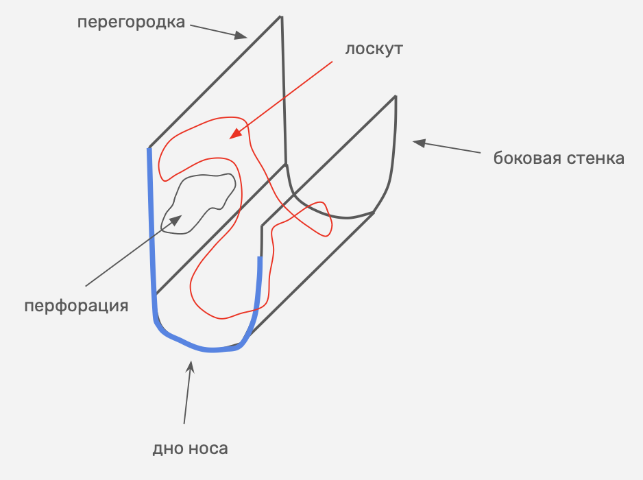
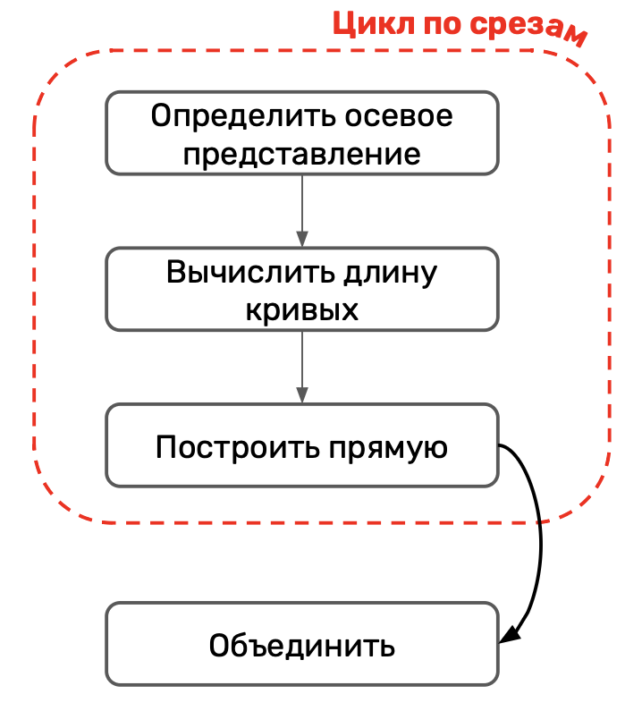
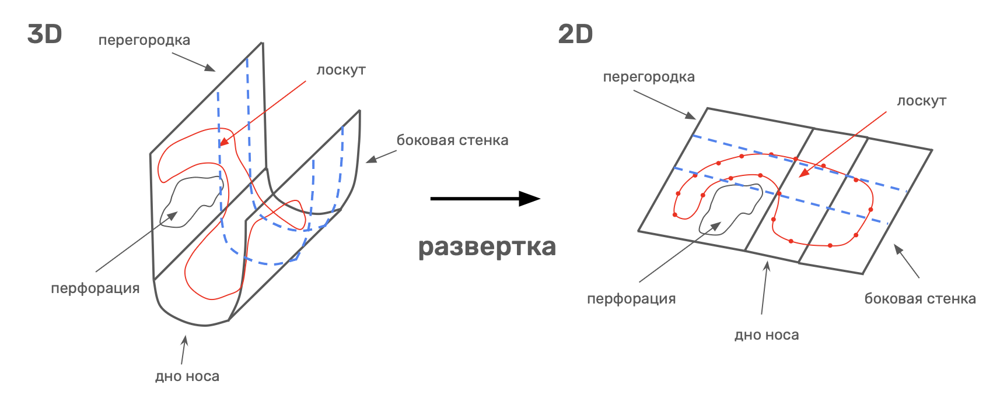

# Mucosa area
Проект создан для автоматического построения развертки сегментированного изображения КТ слизистой оболочки носа.

## Цель проекта
Разработка программного модуля для программного пакета 3D Slicer, который позволит представить трехмерное изображение слизистой оболочки носа в двумерную фигуру с сохранением изначальных размеров.

## Какую проблему решает проект?
Из-за того, что поверхность слизистой оболочки носа является криволинейной провести геометрический анализ довольно сложно. Для этого требуется рассчитать геометрические характеристики каждого сегмента отдельно. Сегментом является: перегородка, дно и боковая (латеральная) стенка носа.


**Рисунок 1. Упрощенный вид слизистой оболочки носа**

## Идея алгоритма развертки
Идея состоит в том, чтобы рассмотреть поверхность слизистой оболочки носа в виде **фронтальных срезов**. На рисунке 1 выделен пример такого среза - **<span style="color:blue">синяя кривая линия</span>**. Развертка кривой линии является прямая с условием, что сохраняется изначальная длина. Таким образом, чтобы построить развертку поверхности нужно рассмотреть фронтальные срезы сегментированного изображения слизистой оболочки носа, выделить для каждого среза осевое представление (кривую линию) и построить развертку, после чего объединить полученные развертки срезов в общую развертку слизистой оболочки носа.



**Рисунок 2. Общий алгоритм развертки**

### Процесс развертки



**Рисунок 3. Процесс развертки**

### Реализованные алгоритмы развертки

#### 1. Spline алгоритм

Алгоритм использует сплайн третей степени для вычисления длины осевого представления среза. Для определения осевого представления разработаны два алгоритма: Метод серединных точек и Метод контурных точек.

Реализация: `algorithms/unfold/spline.py`

**Шаги алгоритма**:
1. Формирование списка фронтальных срезов;
2. Поиск осевого представления с помощью указанного алгоритма;
3. Построение развертки каждого сегмента;
4. Объединение в общую развертку

#### 2. Skeleton алгоритм

Алгоритм использует алгоритм скелетизации для определения осевого представления среза. Для анализа скелетизации используется библиотека `skan`.

Реализация: `algorithms/unfold/skeleton.py`

**Шаги алгоритма**:
1. Формирование списка фронтальных срезов;
2. Поиск осевого представления с помощью алгоритма скелетизации;
3. Построение развертки каждого сегмента;
4. Объединение в общую развертку

## Запуск

Алгоритмы разверток находятся в папке `algorithms/unfold`:
- `skeleton.py` - метод `unfold_skeleton`
- `spline.py` - метод `unfold_spline`

Пример использования алгоритмов находится в `pipeline.ipynb`

В зависимостях можно найти библиотеку `dsepruning`. Она нужна для очистки ненужных веток скелета. Для ее использование пришлось сделать fork и изменить настройки `pyproject.toml` файла. В нем была исправлена ошибка поддержки новой версии `numpy`.

### uv (рекомендуется)

```bash
uv sync
```

### pip

```bash
pip install -r requirements.txt
```


